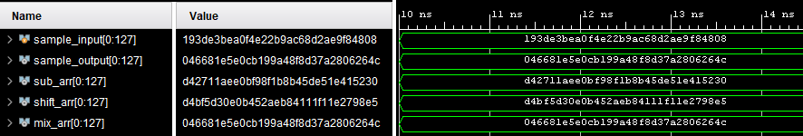

# AES 
HDL implementation of the AES Protocol.

## Sbox Simulation from sbox_tb.v (ran in Vivado):

## Diffusion Concept (from course textbook):
 

## Diffusion Simulation (Sbox + ShiftRow + MixColumn):

## Expected Output (official AES sim):

## Ciphertext Simulation (10 rounds):

## Complete Cipher 
.png "Complete Cipher")
